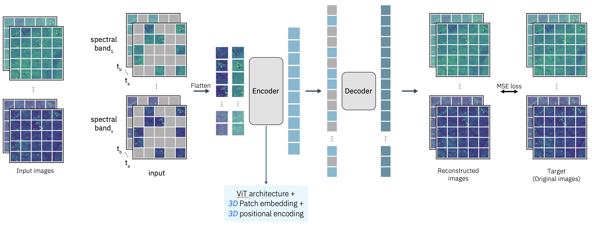

# prithvi-pytorch



This repository provides implementations which extends the Prithvi MAE remote sensing foundation model from the paper ["Foundation Models for Generalist Geospatial Artificial Intelligence", Jakubik et al.](https://arxiv.org/abs/2310.18660) for use as a ViT classifier and a U-Net segmentation model to train with the [TorchGeo](https://github.com/microsoft/torchgeo) library.

### Models

#### ViT Classifier

The ViT implementation performs a forward pass to get output features and then appends a linear classifier head to the CLS output token similar to the `timm` library implementation.

```python
import torch
from prithvi_pytorch import PrithviViT

model = PrithviViT(
    ckpt_path=ckpt_path,  # path to pretrained checkpoint Prithvi_100M.pt
    cfg_path=cfg_path,  # path to pretrained config Prithvi_100M_config.yaml
    num_classes=10,  # num classifier classes
    in_chans=6,  # right now only supports the pretrained 6 channels
    img_size=224,  # supports other image sizes than 224
    freeze_encoder=True  # freeze the pretrained prithvi if you just want to linear probe
)

x = torch.rand(2, 6, 224, 224)  # (b, c, h, w)
y_pred = model(x) # (2, 10) (b, num_classes)
```

#### Encoder Decoder Segmentation Model

Following the [MMSegmentation implementation](https://github.com/NASA-IMPACT/hls-foundation-os/geospatial_fm/geospatial_fm.py) by the authors, we adapt the `ConvTransformerTokensToEmbeddingNeck` decoder to work outside of MMSegmentation. This creates a simple Encoder Decoder network which takes the output embeddings of the Encoder and progressively upsamples them using Conv2dTranspose layers.

```python
import torch
from prithvi_pytorch import PrithviUnet

model = PrithviUnet(
    ckpt_path=ckpt_path,  # path to pretrained checkpoint Prithvi_100M.pt
    cfg_path=cfg_path,  # path to pretrained config Prithvi_100M_config.yaml
    num_classes=10,  # num classifier classes
    in_chans=6,  # right now only supports the pretrained 6 channels
    img_size=224,  # supports other image sizes than 224
    freeze_encoder=True  # freeze the pretrained prithvi
)

x = torch.rand(2, 6, 224, 224)  # (b, c, h, w)
y_pred = model(x) # (2, 10, 224, 224) (b, num_classes, h, w)
```

#### U-Net Segmentation Model

The U-Net implementation grabs `n` intermediate transformer block features and then upsamples them to be passed to U-Net decoder blocks using the `segmentation_models_pytorch` library. This is similar to the implementation in the ["Benchmarking Detection Transfer Learning with Vision Transformers"](https://arxiv.org/abs/2111.11429) paper.

```python
import torch
from prithvi_pytorch import PrithviUnet

model = PrithviUnet(
    ckpt_path=ckpt_path,  # path to pretrained checkpoint Prithvi_100M.pt
    cfg_path=cfg_path,  # path to pretrained config Prithvi_100M_config.yaml
    num_classes=10,  # num classifier classes
    in_chans=6,  # right now only supports the pretrained 6 channels
    img_size=224,  # supports other image sizes than 224
    n=[2, 5, 8, 11],  # indices for intermediate transformer blocks to pass to decoder
    norm=True,  # normalize intermediate features using LayerNorm
    decoder_channels=[256, 128, 64, 32],  # decoder block num feature maps
    freeze_encoder=True  # freeze the pretrained prithvi
)

x = torch.rand(2, 6, 224, 224)  # (b, c, h, w)
y_pred = model(x) # (2, 10, 224, 224) (b, num_classes, h, w)
```

### Datasets

#### HLS Burn Scars

Download the HLS Burn Scars dataset

```bash
wget https://huggingface.co/datasets/ibm-nasa-geospatial/hls_burn_scars/resolve/main/hls_burn_scars.tar.gz?download=true -O hls_burn_scars.tar.gz
tar -xvf hls_burn_scars.tar.gz
```

#### EuroSat

Download the EuroSat MSI version of the dataset:

```bash
wget https://huggingface.co/datasets/torchgeo/eurosat/resolve/main/EuroSATallBands.zip?download=true -O EuroSATallBands.zip
wget https://storage.googleapis.com/remote_sensing_representations/eurosat-train.txt -O eurosat-train.txt
wget https://storage.googleapis.com/remote_sensing_representations/eurosat-val.txt -O eurosat-val.txt
wget https://storage.googleapis.com/remote_sensing_representations/eurosat-test.txt -O eurosat-test.txt
```

### Model Checkpoint

Download the Prithvi model checkpoint and config

```bash
wget https://huggingface.co/ibm-nasa-geospatial/Prithvi-100M/resolve/main/Prithvi_100M.pt?download=true -O Prithvi_100M.pt
wget https://huggingface.co/ibm-nasa-geospatial/Prithvi-100M/resolve/main/Prithvi_100M_config.yaml?download=true -O Prithvi_100M_config.yaml
```

### Examples

- `train_eurosat.ipynb` provides an example of how to train PrithviViT classifier on EuroSAT using `torchgeo`
- `train_hls_burn_scars.ipynb` provides an example of how to train PrithviUnet segmentation on HLS Burn Scars using `torchgeo`

### Tests

```bash
pytest -ra tests
```
